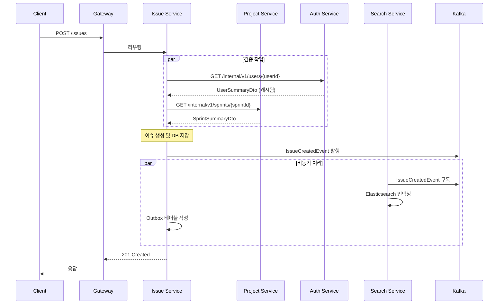
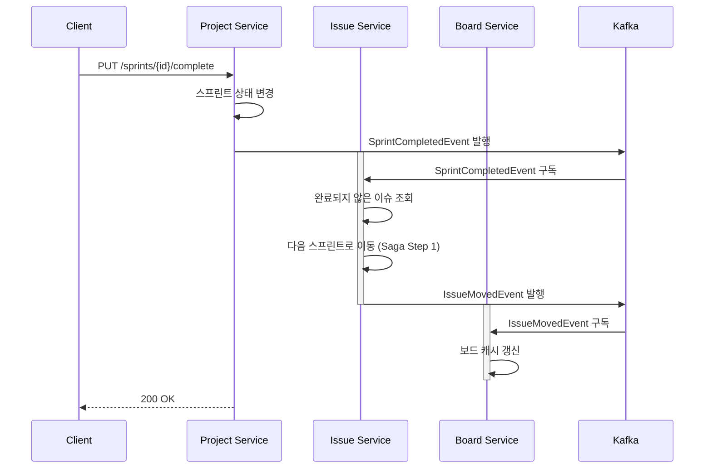
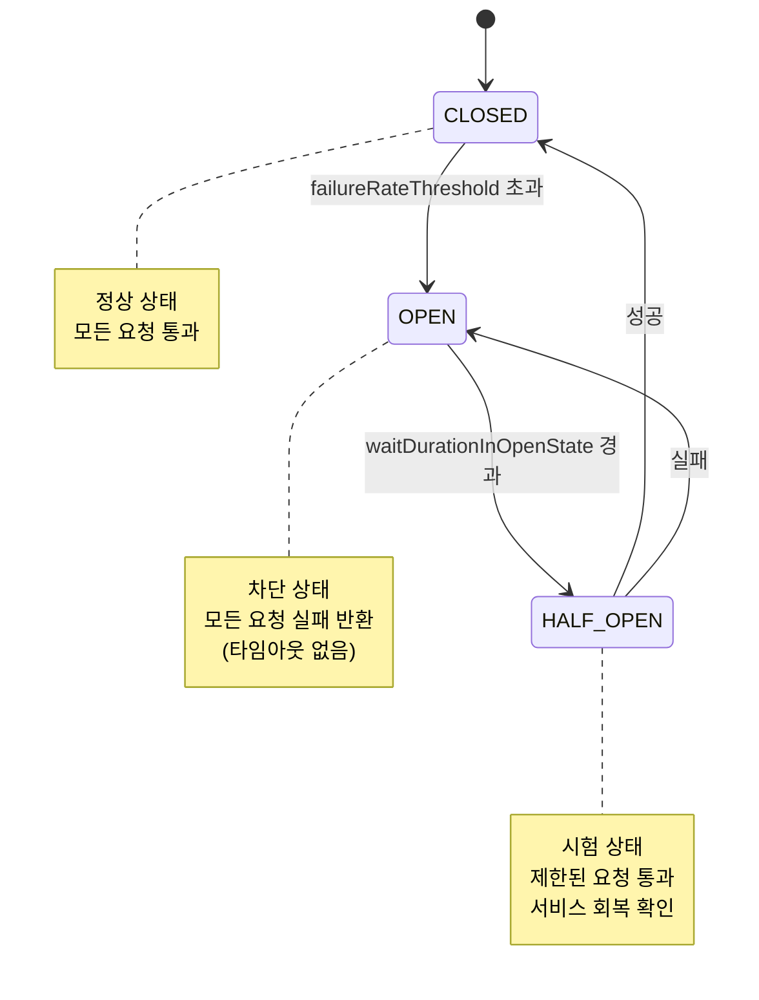

# 서비스 간 통신 설계

## 개요

PCH MSA는 8개의 비즈니스 서비스, 1개의 API Gateway, 1개의 Service Discovery 서버로 구성됩니다. 서비스 간 통신은 동기(REST/Feign) 방식과 비동기(Kafka Event) 방식으로 나뉩니다.

- **동기 통신**: 즉각적인 응답이 필요한 경우 (프로젝트 검증, 사용자 정보 조회)
- **비동기 통신**: 결과적 일관성(Eventual Consistency)을 허용하는 경우 (인덱싱, 알림, 캐시 갱신)

---

## 통신 매트릭스

| 호출 방향 | 호출 방식 | 용도 | 주요 특징 |
|----------|---------|------|---------|
| **Gateway → 각 서비스** | HTTP 동기 | 클라이언트 요청 라우팅 | Eureka 레지스트리 기반 |
| **Issue → Project** | HTTP 동기 + Resilience4j | 프로젝트/스프린트 정보 검증 | Timeout 5초, 3회 재시도 |
| **Issue → Auth** | HTTP 동기 + 캐시 (Redis) | 사용자 정보 및 권한 확인 | 캐시 TTL 30분 |
| **Project → Issue** | Kafka Event 비동기 | 스프린트 완료 시 이슈 자동 이동 | Saga 패턴 적용 |
| **Issue → Search** | Kafka Event 비동기 | Elasticsearch 인덱스 동기화 | 최대 5초 지연 허용 |
| **Issue → Notification** | Kafka Event 비동기 | 알림 발송 (이메일, 웹) | 비차단 처리 |
| **Issue → Board & Report** | Kafka Event 비동기 | 보드 데이터 갱신 및 리포트 생성 | CQRS Read Model 동기화 |
| **Board & Report → Issue** | HTTP 동기 | 보드 상세 데이터 조회 | API Composition |
| **Board & Report → Project** | HTTP 동기 | 스프린트/프로젝트 정보 조회 | 캐시 활용 |

---

## 서비스 간 주요 통신 흐름

### 1. 이슈 생성 흐름 (동기 + 비동기 혼합)



### 2. 스프린트 완료 → 이슈 이동 Saga 패턴



---

## FeignClient 설계 패턴

### 기본 FeignClient 정의

```java
@FeignClient(
    name = "PROJECT-SERVICE",
    url = "${service.project.url}",
    configuration = ProjectClientConfig.class
)
public interface ProjectClient {
    
    @GetMapping("/internal/v1/projects/{projectId}/summary")
    ProjectSummaryDto getProjectSummary(@PathVariable Long projectId);
    
    @GetMapping("/internal/v1/sprints/{sprintId}/summary")
    SprintSummaryDto getSprintSummary(@PathVariable Long sprintId);
    
    @GetMapping("/internal/v1/projects/{projectId}/members/{userId}/role")
    ProjectRole getUserRoleInProject(
        @PathVariable Long projectId,
        @PathVariable Long userId
    );
}
```

### Resilience4j Circuit Breaker + Retry 설정

```java
@Configuration
public class ProjectClientConfig {
    
    @Bean
    public Retryer feignRetryer() {
        return new Retryer.Default(
            100,      // 초기 대기 시간 (ms)
            1000,     // 최대 대기 시간 (ms)
            3         // 최대 재시도 횟수
        );
    }
    
    @Bean
    public Request.Options requestOptions() {
        return new Request.Options(
            5,   // connectTimeout (초)
            10   // readTimeout (초)
        );
    }
    
    @Bean
    public ErrorDecoder errorDecoder() {
        return new FeignErrorDecoder();
    }
}
```

### Resilience4j 설정 (application.yml)

```yaml
resilience4j:
  circuitbreaker:
    instances:
      PROJECT-SERVICE:
        registerHealthIndicator: true
        slidingWindowSize: 10
        minimumNumberOfCalls: 5
        automaticTransitionFromOpenToHalfOpenEnabled: true
        waitDurationInOpenState: 5000
        failureRateThreshold: 50
        slowCallRateThreshold: 50
        slowCallDurationThreshold: 4000
        
  retry:
    instances:
      PROJECT-SERVICE:
        maxAttempts: 3
        waitDuration: 1000
        retryExceptions:
          - org.springframework.web.client.HttpServerErrorException
          - java.net.ConnectException
        ignoreExceptions:
          - org.springframework.web.client.HttpClientErrorException
```

### Fallback 구현

```java
@Component
public class ProjectClientFallback implements ProjectClient {
    
    private static final Logger log = LoggerFactory.getLogger(ProjectClientFallback.class);
    
    @Override
    public ProjectSummaryDto getProjectSummary(Long projectId) {
        log.warn("ProjectClient fallback: getProjectSummary({})", projectId);
        return ProjectSummaryDto.empty();
    }
    
    @Override
    public SprintSummaryDto getSprintSummary(Long sprintId) {
        log.warn("ProjectClient fallback: getSprintSummary({})", sprintId);
        throw new ServiceUnavailableException("Project Service is temporarily unavailable");
    }
}
```

---

## 서비스 간 인증 및 추적

### 인증 헤더 규칙

모든 내부 서비스 호출은 다음 헤더를 포함해야 합니다:

```
X-User-Id: 12345
X-User-Email: john@example.com
X-Correlation-Id: 550e8400-e29b-41d4-a716-446655440000
X-Span-Id: trace-span-001
```

### FeignClient에 인터셉터 추가

```java
@Configuration
public class FeignClientInterceptor implements RequestInterceptor {
    
    private static final String X_USER_ID = "X-User-Id";
    private static final String X_USER_EMAIL = "X-User-Email";
    private static final String X_CORRELATION_ID = "X-Correlation-Id";
    
    @Override
    public void apply(RequestTemplate template) {
        String userId = SecurityContextHolder.getContext()
            .getAuthentication()
            .getPrincipal()
            .toString();
        
        String correlationId = MDC.get("correlationId");
        if (correlationId == null) {
            correlationId = UUID.randomUUID().toString();
        }
        
        template.header(X_USER_ID, userId);
        template.header(X_CORRELATION_ID, correlationId);
    }
}
```

---

## 타임아웃 및 재시도 정책

### 정책 기준표

| 서비스 호출 | 연결 Timeout | 읽기 Timeout | 재시도 횟수 | 재시도 대상 |
|----------|------------|------------|----------|----------|
| Project Service | 3초 | 5초 | 3회 | 500, 503, Connection 오류 |
| Auth Service | 2초 | 3초 | 2회 | 503만 |
| Search Service | 5초 | 10초 | 1회 | 500, 503 |
| File Service | 10초 | 30초 | 1회 | 503만 |

### 적용 예시

```java
@Retryable(
    value = {FeignException.InternalServerError.class, FeignException.ServiceUnavailable.class},
    maxAttempts = 3,
    backoff = @Backoff(delay = 1000, multiplier = 2.0)
)
public ProjectSummaryDto getProjectInfo(Long projectId) {
    return projectClient.getProjectSummary(projectId);
}

@Recover
public ProjectSummaryDto recoverGetProjectInfo(FeignException e, Long projectId) {
    log.error("Failed to get project info after retries: {}", projectId, e);
    return ProjectSummaryDto.empty(); // Fallback
}
```

---

## Circuit Breaker 전략

### 상태 전이



### Health Check 모니터링

```yaml
management:
  health:
    circuitbreakers:
      enabled: true
  endpoints:
    web:
      exposure:
        include: health,circuitbreaker
```

---

## 비동기 통신 (Kafka)

### 메시지 전송 신뢰성

```java
@Configuration
public class KafkaProducerConfig {
    
    @Bean
    public ProducerFactory<String, DomainEvent> producerFactory() {
        Map<String, Object> configProps = new HashMap<>();
        configProps.put(ProducerConfig.BOOTSTRAP_SERVERS_CONFIG, "localhost:9092");
        configProps.put(ProducerConfig.KEY_SERIALIZER_CLASS_CONFIG, StringSerializer.class);
        configProps.put(ProducerConfig.VALUE_SERIALIZER_CLASS_CONFIG, JsonSerializer.class);
        configProps.put(ProducerConfig.ACKS_CONFIG, "all");  // 모든 레플리카 확인
        configProps.put(ProducerConfig.RETRIES_CONFIG, 3);
        configProps.put(ProducerConfig.COMPRESSION_TYPE_CONFIG, "snappy");
        
        return new DefaultProducerFactory<>(configProps);
    }
    
    @Bean
    public KafkaTemplate<String, DomainEvent> kafkaTemplate() {
        return new KafkaTemplate<>(producerFactory());
    }
}
```

### 이벤트 발행 (Outbox 패턴)

```java
@Service
public class IssueService {
    
    private final IssueRepository issueRepository;
    private final OutboxEventRepository outboxEventRepository;
    private final KafkaTemplate<String, DomainEvent> kafkaTemplate;
    
    @Transactional
    public IssueResponse createIssue(IssueCreateRequest request) {
        // Step 1: 이슈 생성 및 저장
        Issue issue = new Issue(request);
        issueRepository.save(issue);
        
        // Step 2: Outbox에 이벤트 저장 (같은 트랜잭션)
        OutboxEvent event = new OutboxEvent(
            "issue.created",
            issue.getId(),
            IssueCreatedEvent.from(issue)
        );
        outboxEventRepository.save(event);
        
        return IssueResponse.from(issue);
    }
    
    @Scheduled(fixedDelay = 1000)
    public void publishOutboxEvents() {
        List<OutboxEvent> unpublished = outboxEventRepository.findByPublished(false);
        
        unpublished.forEach(event -> {
            try {
                kafkaTemplate.send(event.getTopic(), event.getPayload());
                event.markAsPublished();
                outboxEventRepository.save(event);
            } catch (Exception e) {
                log.error("Failed to publish event: {}", event.getId(), e);
            }
        });
    }
}
```

### 이벤트 구독 (Consumer)

```java
@Service
public class SearchEventListener {
    
    private final SearchIndexService searchIndexService;
    
    @KafkaListener(
        topics = "issue.created",
        groupId = "search-service-group",
        containerFactory = "kafkaListenerContainerFactory"
    )
    public void onIssueCreated(IssueCreatedEvent event) {
        try {
            searchIndexService.indexIssue(event);
            log.info("Indexed issue: {}", event.getIssueKey());
        } catch (Exception e) {
            log.error("Failed to index issue: {}", event.getIssueKey(), e);
            throw e; // Retry
        }
    }
    
    @KafkaListener(
        topics = "issue.created",
        groupId = "search-service-group",
        containerFactory = "kafkaListenerContainerFactory"
    )
    public void onIssueCreatedDLQ(IssueCreatedEvent event) {
        // DLQ 처리 로직
    }
}
```

---

## 성능 고려사항

### 캐싱 전략

- **Auth Service**: 사용자 정보 캐시 (TTL: 30분)
- **Project Service**: 프로젝트/스프린트 정보 (TTL: 1시간, 이벤트 기반 무효화)
- **Issue Service**: 담당자 정보 (TTL: 15분)

### 배치 호출 최적화

```java
@PostMapping("/internal/v1/users/batch")
public List<UserSummaryDto> getUsersSummary(@RequestBody List<Long> userIds) {
    return userService.getUsersSummaryByIds(userIds);
}

// 호출 측
@Service
public class IssueService {
    
    private final AuthClient authClient;
    private final List<Long> userIdBatch = Collections.synchronizedList(new ArrayList<>());
    
    public void enrichIssueWithUserInfo(Issue issue) {
        userIdBatch.add(issue.getAssigneeId());
        
        if (userIdBatch.size() >= 50) {
            flushUserBatch();
        }
    }
    
    @Scheduled(fixedDelay = 500)
    public void flushUserBatch() {
        if (!userIdBatch.isEmpty()) {
            List<UserSummaryDto> users = authClient.getUsersSummary(
                new ArrayList<>(userIdBatch)
            );
            // 캐시 업데이트
            userIdBatch.clear();
        }
    }
}
```

---

## 모니터링 및 추적

### Distributed Tracing (Sleuth + Zipkin)

```java
@Configuration
public class TracingConfig {
    
    @Bean
    public Sampler defaultSampler() {
        return Sampler.ALWAYS_SAMPLE;
    }
}
```

```yaml
spring:
  zipkin:
    base-url: http://localhost:9411
  sleuth:
    sampler:
      probability: 1.0  # 개발: 100%, 프로덕션: 0.1
```

### 메트릭 수집 (Micrometer)

```java
@Configuration
public class MetricsConfig {
    
    @Bean
    public MeterRegistryCustomizer metricsCustomizer() {
        return registry -> registry.config()
            .commonTags(
                "application", "pch",
                "environment", "${app.environment}"
            );
    }
}
```

---

## 체크리스트

- [ ] 모든 FeignClient에 Resilience4j 설정 적용
- [ ] 내부 API 호출 시 X-User-Id, X-Correlation-Id 헤더 포함
- [ ] 이벤트 발행은 Outbox 패턴으로 구현
- [ ] 타임아웃/재시도 정책 설정 확인
- [ ] Circuit Breaker 모니터링 대시보드 구성
- [ ] 캐시 무효화 전략 검토
- [ ] DLQ 토픽 모니터링 설정
