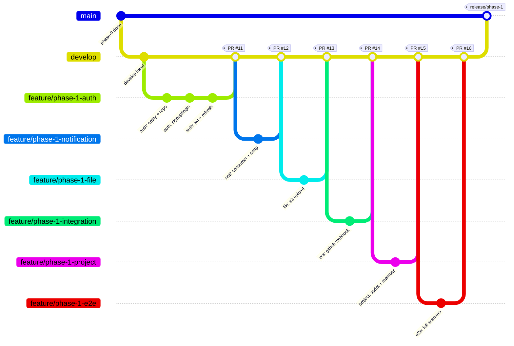

# Phase 1 — Task Workflows (개요)

Phase 1 (주변 서비스 분리, 4주)의 **작업 단위별 실행 워크플로우**를 정의합니다.
각 태스크는 독립된 `feature/*` 브랜치에서 진행하고, 완료 시 `develop` 으로 PR을 올립니다.

`00-phase-1-overview.md` 가 **"무엇을"** 만드는지 정의한다면, 이 문서 세트는 **"어떻게"** 만드는지를 정의합니다.

---

## 🧭 전체 흐름 (Hig-Level Flow)



---

## 📋 태스크 카탈로그

| # | 태스크 | 브랜치 | 의존성 | 산출물 | 문서 |
|---|--------|--------|--------|--------|------|
| T1 | **Auth Service 분리**         | `feature/phase-1-auth`          | Phase 0       | `pch-auth-service` 완성, JWT 발급/검증       | [01-auth-workflow.md](./01-auth-workflow.md) |
| T2 | **Notification Service 분리** | `feature/phase-1-notification`  | T1 (이벤트)    | Kafka Consumer + Email/Slack 발송 채널     | [02-notification-workflow.md](./02-notification-workflow.md) |
| T3 | **File Service 분리**         | `feature/phase-1-file`          | T1 (인증)      | 첨부파일 업로드/다운로드, S3 스토리지 추상화 | [03-file-workflow.md](./03-file-workflow.md) |
| T4 | **Integration Service 분리**  | `feature/phase-1-integration`   | T1 (인증)      | GitHub 웹훅, VCS 커밋 링크 이벤트 발행        | [04-integration-workflow.md](./04-integration-workflow.md) |
| T5 | **Project Service 분리**      | `feature/phase-1-project`       | T1, T2, T3    | Project/Sprint/Member/Label CRUD + 이벤트 | [05-project-workflow.md](./05-project-workflow.md) |
| T6 | **통합 검증 (E2E)**           | `feature/phase-1-e2e`           | T1~T5         | E2E 시나리오 테스트, 성능 기준선, 장애 시나리오 | [06-integration-testing-workflow.md](./06-integration-testing-workflow.md) |

> T2~T4 는 T1 완료 후 **병렬 진행 가능**. 단, 각 팀은 독립된 `feature/*` 브랜치에서 작업합니다.

---

## 🌿 브랜치 전략

```
main           (production, tag: v0.x.0)
 ├── develop   (integration branch, Phase 1 작업의 목표지점)
 │    ├── feature/phase-1-auth
 │    ├── feature/phase-1-notification
 │    ├── feature/phase-1-file
 │    ├── feature/phase-1-integration
 │    ├── feature/phase-1-project
 │    └── feature/phase-1-e2e
 └── hotfix/*  (긴급 패치용)
```

- **베이스 브랜치**: 모든 Phase 1 feature 브랜치는 `develop` 에서 분기
- **PR 타깃**: 항상 `develop`
- **Merge 전략**: **Squash and Merge** (feature 브랜치 내 커밋은 보존되나, develop 에는 하나의 커밋으로)
- **수명**: feature 브랜치는 PR 머지 후 **즉시 삭제**
- **네이밍**: `feature/phase-{n}-{service-or-topic}` 형식 고정

---

## ✍️ 커밋 규약 (Conventional Commits)

```
<type>(<scope>): <subject>

<body (한국어 OK, 왜/무엇을)>
```

| type       | 용도                                  | 예시                                                 |
|------------|---------------------------------------|------------------------------------------------------|
| `feat`     | 새 기능                               | `feat(auth): 회원가입 API 구현`                      |
| `fix`      | 버그 수정                             | `fix(auth): RefreshToken 만료 판단 오류 수정`         |
| `refactor` | 리팩터링 (기능/버그 변화 없음)         | `refactor(project): Sprint 도메인 분리`               |
| `test`     | 테스트만 추가/수정                     | `test(file): S3Service 업로드 MockServer 테스트`      |
| `docs`     | 문서                                  | `docs(phase-1): auth workflow 업데이트`               |
| `chore`    | 빌드/CI/의존성                         | `chore(deps): jjwt 0.12.6 → 0.12.7 업데이트`          |
| `perf`     | 성능                                  | `perf(search): bulk index batch size 조정`            |

> 상세는 [_templates/commit-convention.md](./_templates/commit-convention.md) 참고.

---

## ✅ Definition of Done (공통 DoD)

각 태스크 PR 머지 전에 **반드시** 만족해야 할 기준:

- [ ] 단위 테스트 커버리지 **80% 이상** (변경된 파일 기준)
- [ ] `./gradlew build` 성공 (CI 녹색)
- [ ] 컨트롤러에 **Swagger/OpenAPI 어노테이션** 존재
- [ ] 새로운 공개 API 는 [docs/architecture/api-contract.md](../../../architecture/api-contract.md) 에 반영
- [ ] 새로운 이벤트는 [docs/architecture/event-catalog.md](../../../architecture/event-catalog.md) 에 반영
- [ ] DB 스키마 변경은 `db/migration/VXXX__*.sql` 로 추가 (Flyway)
- [ ] `docker compose up -d` + `./gradlew :서비스:bootRun` 로 로컬 기동 성공
- [ ] 예외 흐름에 대한 로그 레벨 적절 (WARN/ERROR 구분)
- [ ] PR 리뷰어 **최소 1명** 승인
- [ ] 관련 문서(`docs/phases/phase-1/*.md`) 업데이트

> 서비스별 추가 DoD 는 각 워크플로우 문서 하단에 정의되어 있습니다.

---

## 🚦 PR 수명주기

1. **Draft PR 먼저 올리기** — WIP 이라도 조기에 CI 를 돌리고 얼리 피드백을 받습니다.
2. **Ready for review 전환** — DoD 체크리스트를 자체 확인한 후 전환.
3. **코드 리뷰** — 리뷰어는 24h 이내 응답 (SLA).
4. **수정 → 재요청** — force-push 대신 fixup commit 후 머지 전에 squash.
5. **Squash and Merge** — 최종 커밋 메시지는 PR 제목을 사용 (Conventional Commits).
6. **자동 브랜치 삭제** — GitHub 설정으로 머지 직후 삭제.

---

## 🧪 CI/CD 게이트

| 게이트         | 통과 조건                                        | 실패 시 조치                                 |
|----------------|--------------------------------------------------|----------------------------------------------|
| Build          | `./gradlew clean build -x test` 성공            | 컴파일 오류 → 즉시 수정                       |
| Unit Test      | `./gradlew test` 성공, 커버리지 80%+            | 추가 테스트 작성                              |
| Lint/Check     | `./gradlew check` 성공                           | 포맷/스타일 수정                              |
| Docker Validate| `docker compose config` 성공                    | YAML 문법 / 환경변수 수정                     |
| PR 제목 검증   | Conventional Commits 준수                       | PR 제목 수정                                   |
| 보안 스캔      | Snyk/Trivy 크리티컬 없음 (Phase 2 이후 도입)     | 취약 의존성 업그레이드                        |

---

## 📁 문서 구조

```
docs/phases/phase-1/task-workflows/
├── 00-overview.md                          (이 문서)
├── 01-auth-workflow.md                     Auth Service
├── 02-notification-workflow.md             Notification Service
├── 03-file-workflow.md                     File Service
├── 04-integration-workflow.md              Integration Service
├── 05-project-workflow.md                  Project Service
├── 06-integration-testing-workflow.md      통합 검증
└── _templates/
    ├── pr-template.md                      PR 본문 템플릿
    ├── commit-convention.md                Conventional Commits 상세
    └── definition-of-done.md               DoD 체크리스트 (공통)
```

---

## 🗓️ 주차별 간트 (권장)

```
Week 1     Week 2           Week 3                Week 4
┌───────┐
│  T1   │  feature/phase-1-auth
└───────┘
        ┌───────────┐
        │    T2     │  feature/phase-1-notification
        └───────────┘
        ┌───────────┐
        │    T3     │  feature/phase-1-file
        └───────────┘
                    ┌───────────┐
                    │    T4     │  feature/phase-1-integration
                    └───────────┘
                    ┌───────────────────┐
                    │        T5         │  feature/phase-1-project
                    └───────────────────┘
                                          ┌───────────┐
                                          │    T6     │  feature/phase-1-e2e
                                          └───────────┘
```

- T1 (Auth) 완료 전까지 T2~T5 는 **로컬 토큰(Dev JWT)** 으로 작업 가능
- T5 (Project) 는 T2/T3 의 이벤트 발행에 **선의존** → 두 서비스의 이벤트 스키마가 확정된 시점에 착수

---

**Last Updated**: 2026-04-16
**Version**: 1.0
**Related**:
- [../00-phase-1-overview.md](../00-phase-1-overview.md)
- [../../../architecture/event-catalog.md](../../../architecture/event-catalog.md)
- [../../../guides/coding-conventions.md](../../../guides/coding-conventions.md)
