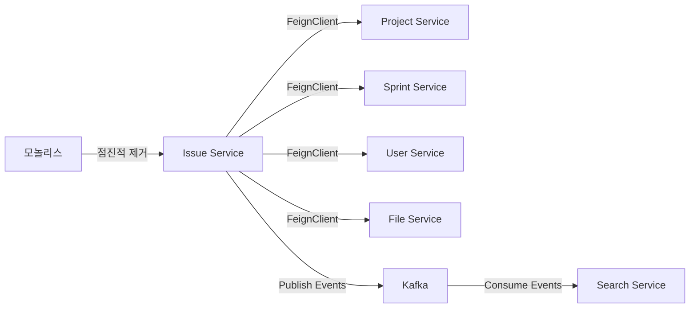

# Phase 2: 핵심 서비스 분리 (4주)

## 개요

Phase 2는 PCH 마이그레이션 프로젝트의 **가장 핵심이 되는 단계**입니다. Issue Service를 독립적인 마이크로서비스로 분리함으로써 전체 MSA 아키텍처의 기초를 다집니다.

### 목표

- **Issue Service** 완전 분리: 이슈 관리의 모든 기능을 독립 서비스화
- 외래키(FK) 물리적 제거 및 논리적 참조 기반으로 전환
- 이벤트 기반 아키텍처 확립
- 마이크로서비스 간 통신 패턴 정립 (Sync API + Async Events)

### 왜 Issue Service가 가장 복잡한가?

Issue Service는 PCH의 **핵심 도메인**이자 **가장 복잡한 의존성**을 가집니다:

| 항목 | 수량 | 설명 |
|------|------|------|
| **소유 엔티티** | 12개 | issue, comment, audit_log, automation_rule 등 |
| **Repository 의존성** | 12+개 | Project, Sprint, User, File, Elasticsearch 등 |
| **API 엔드포인트** | 15+개 | CRUD, 검색, 필터, 워크플로우, 자동화 등 |
| **외부 의존성** | 5개 | Project, Sprint, User, File, Search 서비스 |
| **이벤트** | 6+개 | 이슈 생성, 수정, 상태 변경, 삭제, 댓글 등 |

### Phase 2 타임라인 (4주 = 20 업무일)

#### 1주차: 기본 구조 + 엔티티 마이그레이션
- [ ] Issue Service 모듈 구조 설계 및 생성
- [ ] 12개 엔티티 이동 및 FK 물리적 제거
- [ ] 데이터베이스 스키마 마이그레이션 (MySQL)
- [ ] 엔티티 검증 및 데이터 정합성 확인
- [ ] **주요 결과물**: Issue Service 기본 구조 + DB 스키마

#### 2주차: 비즈니스 로직 전환
- [ ] Repository 직접 참조 → FeignClient로 전환
- [ ] IssueService, WorkflowEngine, AutomationEngine 리팩토링
- [ ] Spring Event 기반 이벤트 발행 구현
- [ ] Resilience4j (Circuit Breaker, Retry) 설정
- [ ] **주요 결과물**: 비즈니스 로직 + 서비스 간 통신

#### 3주차: 댓글, 감사 로그, 보안 전환
- [ ] CommentService, AuditService 이동
- [ ] RBAC 시스템 재구축 (ProjectClient 기반)
- [ ] 메멘션 파싱 및 알림 메커니즘
- [ ] IssueVisibilityEvaluator 전환
- [ ] **주요 결과물**: Comment, Audit, Security 모듈

#### 4주차: 검증 & 안정화
- [ ] 통합 테스트 작성 (Controller, Service, Repository)
- [ ] Saga 패턴 검증 (이벤트 기반 분산 트랜잭션)
- [ ] 기존 모놀리스와의 호환성 테스트
- [ ] 성능 벤치마크 (쿼리 성능, 응답 시간)
- [ ] 버그 수정 및 문서 작성
- [ ] **주요 결과물**: 프로덕션 배포 가능 상태

---

## 핵심 도전과제

### 1. 외래키(FK) 해제
**문제**: Issue ↔ Project, Sprint, User 간에 강한 FK 관계 존재
- 현행: `issue.project_id` FK → `project.id`
- **해결책**: FK 제거, Long 타입 ID만 유지, 데이터 정합성은 이벤트로 검증

**영향도**: 
- DB 스키마: ALTER TABLE issue DROP FOREIGN KEY fk_issue_project;
- JPA 엔티티: @ManyToOne(fetch = FetchType.EAGER) 제거
- 데이터 정합성: 이벤트 기반 검증 로직 추가

### 2. API 호출 패턴 전환
**문제**: 모놀리스에서는 직접 Repository 호출, MSA에서는 네트워크 호출 필요
- 현행: `projectRepository.findById(projectId).orElseThrow()`
- **해결책**: OpenFeign 클라이언트로 감싸기 + Resilience4j

**예시**:
```java
// 모놀리스 (직접 참조)
Project project = projectRepository.findById(projectId);

// MSA (Feign 호출)
Project project = projectClient.getProject(projectId);
```

**리스크**: 네트워크 지연, 서비스 다운, Circuit Breaker 필요

### 3. 자동화 엔진 이동
**문제**: AutomationEngine이 Issue, Comment, Project를 모두 참조
- 현행: 단일 프로세스 내 트랜잭션
- **해결책**: Issue Service로 이동, 외부 이벤트는 비동기 처리 (Kafka)

**리스크**: 자동화 규칙이 실패할 경우 보상 로직 필요

### 4. 이벤트 기반 일관성 보장
**문제**: 분산 트랜잭션 환경에서 데이터 정합성 보장 어려움
- **해결책**: Outbox 패턴 + Saga 패턴 + 이벤트 기반 검증

---

## 완료 기준 (Definition of Done)

### 기능 요구사항
- [ ] Issue Service가 모든 이슈 CRUD 기능 지원
- [ ] Comment, Audit, Automation 기능 정상 동작
- [ ] Project, Sprint, User 서비스 간 통신 정상 (Timeout 없음)
- [ ] 이벤트 발행/구독 정상 동작 (Kafka)
- [ ] RBAC 시스템 정상 작동

### 비기능 요구사항
- [ ] **응답시간**: P95 < 200ms (단일 서비스 호출)
- [ ] **에러율**: < 0.1% (정상 트래픽 기준)
- [ ] **가용성**: 99.5% (Circuit Breaker + Fallback 포함)
- [ ] **데이터 정합성**: 이벤트 발행 100% 검증 (Outbox 패턴)

### 테스트 커버리지
- [ ] 단위 테스트: >= 80% (비즈니스 로직)
- [ ] 통합 테스트: 모든 API 엔드포인트
- [ ] E2E 테스트: 주요 워크플로우 (이슈 생성 → 상태 변경 → 댓글 → 완료)

### 문서 & 배포
- [ ] API 문서 (Swagger/OpenAPI) 작성
- [ ] 마이그레이션 가이드 작성
- [ ] 운영 플레이북 작성
- [ ] Docker Image & Helm Chart 준비

---

## 의존성 관계도



---

## 주요 체크포인트

| 주차 | 체크포인트 | 상태 |
|------|-----------|------|
| 1주차 | Issue Service 모듈 생성, 엔티티 이동 완료 | - |
| 2주차 | 비즈니스 로직 리팩토링, FeignClient 구현 | - |
| 3주차 | Comment/Audit/Security 모듈 완성 | - |
| 4주차 | 통합 테스트, 성능 튜닝, 문서 작성 | - |
| 배포전 | 프로덕션 환경 검증, 롤백 계획 수립 | - |

---

## 참고 문서

- `01-issue-service-structure.md`: Issue Service 아키텍처
- `02-entity-migration.md`: 엔티티 마이그레이션 상세 가이드
- `03-business-logic.md`: 비즈니스 로직 전환
- `04-comment-audit.md`: Comment, Audit, Security 모듈
- `05-saga-pattern.md`: Saga 패턴 및 분산 트랜잭션
