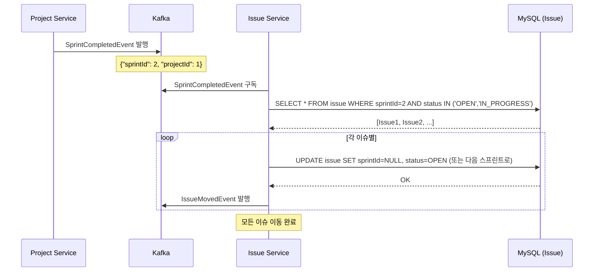
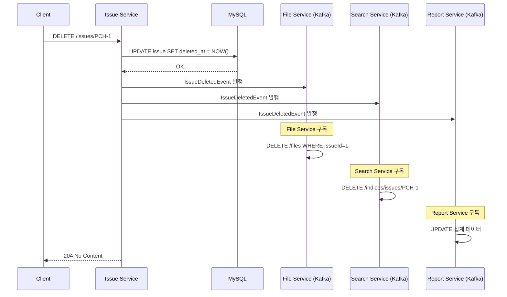

# Saga 패턴 적용

## 개요

MSA 환경에서는 **분산 트랜잭션** 처리가 필수입니다. Issue Service가 Project Service, Sprint Service 등과 상호작용할 때 ACID를 보장하기 위해 **Saga 패턴**을 사용합니다.

---

## Saga 패턴 개요

### Saga란?

여러 마이크로서비스에 걸친 분산 트랜잭션을 관리하는 패턴입니다.

| 특성 | 설명 |
|------|------|
| **원자성** | 각 서비스 작업을 개별 트랜잭션으로 처리 |
| **일관성** | 실패 시 보상 트랜잭션 실행 |
| **고립성** | 서비스 간 느슨한 결합 |
| **지속성** | 완료된 작업은 보장 |

### Choreography vs Orchestration

#### 1. Choreography (이벤트 기반)
```
Issue Service: IssueCreatedEvent 발행
    ↓
Search Service: 이벤트 구독 → 인덱싱
    ↓
File Service: 이벤트 구독 → 파일 처리
```

**장점**: 느슨한 결합, 확장성
**단점**: 흐름 파악 어려움, 순환 의존성 위험

#### 2. Orchestration (중앙 관리)
```
Saga Orchestrator:
  1. Issue Service: 이슈 생성
  2. Search Service: 인덱싱
  3. File Service: 파일 처리
  (각 단계 실패 시 보상)
```

**장점**: 명확한 흐름, 재시도 관리
**단점**: 중앙 집중식, 단일 실패점

### Phase 2 적용 전략

Issue Service는 **Choreography (이벤트 기반)**를 기본으로 하되, 복잡한 다단계 프로세스는 **Orchestration**을 사용합니다.

---

## 적용 사례 1: 스프린트 완료 → 미완료 이슈 이동

### 시나리오

**상황**: Project Service에서 스프린트가 완료됨
- 스프린트의 미완료 이슈(OPEN, IN_PROGRESS) 자동 이동
- 대상: 백로그 또는 다음 스프린트
- 실패 시: 원래 상태 복원

### 시퀀스 다이어그램



### 1. Event 정의

```java
// Project Service에서 발행
@Getter
public class SprintCompletedEvent {
    private Long sprintId;
    private Long projectId;
    private String sprintName;
    private LocalDateTime completedAt;
    
    public SprintCompletedEvent(Long sprintId, Long projectId, 
                               String sprintName, LocalDateTime completedAt) {
        this.sprintId = sprintId;
        this.projectId = projectId;
        this.sprintName = sprintName;
        this.completedAt = completedAt;
    }
}

// Issue Service에서 발행 (응답 이벤트)
@Getter
public class IssueMovedToBacklogEvent {
    private String issueKey;
    private Long sprintId;
    private Long targetSprintId;
    private String reason;
    private LocalDateTime movedAt;
}
```

### 2. 이벤트 핸들러

```java
@Service
public class SprintCompletionSagaHandler {
    
    @Autowired
    private IssueRepository issueRepository;
    
    @Autowired
    private SprintClient sprintClient;
    
    @Autowired
    private ApplicationEventPublisher eventPublisher;
    
    @KafkaListener(topics = "sprint-completed", groupId = "issue-service")
    @Transactional
    public void handleSprintCompleted(SprintCompletedEvent event) {
        logger.info("Sprint {} completed, moving incomplete issues", event.getSprintId());
        
        try {
            // 1. 미완료 이슈 조회
            List<Issue> incompleteIssues = issueRepository.findBySprintIdAndStatusIn(
                event.getSprintId(),
                List.of("OPEN", "IN_PROGRESS", "BLOCKED")
            );
            
            if (incompleteIssues.isEmpty()) {
                logger.info("No incomplete issues found");
                return;
            }
            
            logger.info("Found {} incomplete issues", incompleteIssues.size());
            
            // 2. 스프린트 정보 조회 (다음 스프린트 찾기)
            Long targetSprintId = sprintClient.getNextSprint(
                event.getProjectId(), 
                event.getSprintId()
            ).getId();
            
            // 3. 이슈 이동
            int movedCount = 0;
            for (Issue issue : incompleteIssues) {
                try {
                    moveIssueToSprint(issue, targetSprintId, event.getSprintId(), event);
                    movedCount++;
                } catch (Exception e) {
                    logger.error("Failed to move issue {}", issue.getKey(), e);
                    // 개별 이슈 실패는 롤백하지 않음 (부분 성공)
                    publishFailureEvent(issue, event, e);
                }
            }
            
            logger.info("Successfully moved {} issues to sprint {}", 
                movedCount, targetSprintId);
            
            // 4. Saga 완료 이벤트 발행
            publishCompletionEvent(event, movedCount, incompleteIssues.size());
            
        } catch (Exception e) {
            logger.error("Sprint completion saga failed", e);
            // 전체 실패 시 모든 변경 롤백 (Transactional)
            throw new RuntimeException("Saga rollback triggered", e);
        }
    }
    
    private void moveIssueToSprint(Issue issue, Long targetSprintId, 
                                   Long sourceSusprintId, SprintCompletedEvent event) {
        // 이전 상태 저장 (보상용)
        issue.setPreviousSprintId(sourceSusprintId);
        issue.setSprintId(targetSprintId);
        
        issueRepository.save(issue);
        
        // 이동 이벤트 발행
        eventPublisher.publishEvent(new IssueMovedToBacklogEvent(
            issue.getKey(),
            sourceSusprintId,
            targetSprintId,
            "sprint_completion",
            LocalDateTime.now()
        ));
    }
    
    private void publishCompletionEvent(SprintCompletedEvent event, 
                                       int movedCount, int totalCount) {
        // 완료 이벤트 (Search Service, Report Service 등에서 구독)
        eventPublisher.publishEvent(new SprintCompletionCompletedEvent(
            event.getSprintId(),
            event.getProjectId(),
            movedCount,
            totalCount
        ));
    }
    
    private void publishFailureEvent(Issue issue, SprintCompletedEvent event, Exception e) {
        eventPublisher.publishEvent(new IssueMovementFailedEvent(
            issue.getKey(),
            event.getSprintId(),
            e.getMessage()
        ));
    }
}
```

### 3. 보상 트랜잭션

```java
@Service
public class IssueMovementCompensationHandler {
    
    @Autowired
    private IssueRepository issueRepository;
    
    /**
     * 이슈 이동 실패 시 원래 상태로 복원
     */
    @KafkaListener(topics = "issue-movement-failed", groupId = "issue-service")
    @Transactional
    public void compensateIssueMovement(IssueMovementFailedEvent event) {
        logger.warn("Compensating issue movement for {}: {}", 
            event.getIssueKey(), event.getFailureReason());
        
        Issue issue = issueRepository.findById(event.getIssueKey())
            .orElseThrow(() -> new IssueNotFoundException(event.getIssueKey()));
        
        // 이전 스프린트로 복원
        Long previousSprintId = issue.getPreviousSprintId();
        if (previousSprintId != null) {
            issue.setSprintId(previousSprintId);
            issueRepository.save(issue);
            
            logger.info("Issue {} reverted to sprint {}", 
                event.getIssueKey(), previousSprintId);
        }
    }
}
```

---

## 적용 사례 2: 이슈 삭제 → 연관 데이터 정리

### 시나리오

**상황**: 이슈가 삭제됨
- Soft delete로 표시 (deleted_at 필드)
- 첨부파일 삭제 (File Service)
- 검색 인덱스 제거 (Search Service)
- 보드/리포트 데이터 업데이트

### 시퀀스 다이어그램



### 1. 이슈 삭제 구현

```java
@Service
@Transactional
public class IssueService {
    
    @Autowired
    private IssueRepository issueRepository;
    
    @Autowired
    private FileClient fileClient;
    
    @Autowired
    private ApplicationEventPublisher eventPublisher;
    
    /**
     * 이슈 soft delete
     */
    public void deleteIssue(String issueKey) {
        Issue issue = issueRepository.findById(issueKey)
            .orElseThrow(() -> new IssueNotFoundException(issueKey));
        
        // 현재 사용자 확인 (관리자만 삭제 가능)
        if (!isAdmin()) {
            throw new IssueAccessDeniedException();
        }
        
        // Soft delete
        issue.setDeletedAt(LocalDateTime.now());
        issue.setDeletedBy(getCurrentUserId());
        
        issueRepository.save(issue);
        
        // 이벤트 발행 (비동기 처리)
        eventPublisher.publishEvent(new IssueDeletedEvent(issue));
    }
    
    /**
     * 이슈 복구 (Undo)
     */
    @Transactional
    public Issue restoreIssue(String issueKey) {
        Issue issue = issueRepository.findById(issueKey)
            .orElseThrow(() -> new IssueNotFoundException(issueKey));
        
        if (issue.getDeletedAt() == null) {
            throw new IssueAlreadyRestoredExcept();
        }
        
        // 복구
        issue.setDeletedAt(null);
        issue.setDeletedBy(null);
        
        issueRepository.save(issue);
        
        // 복구 이벤트 발행
        eventPublisher.publishEvent(new IssueRestoredEvent(issue));
        
        return issue;
    }
}
```

### 2. 다중 서비스 이벤트 처리

```java
// File Service 이벤트 핸들러
@Service
public class IssueDeletedFileHandler {
    
    @Autowired
    private FileRepository fileRepository;
    
    @KafkaListener(topics = "issue-deleted", groupId = "file-service")
    @Transactional
    public void handleIssueDeletion(IssueDeletedEvent event) {
        logger.info("Deleting files for issue {}", event.getIssueKey());
        
        try {
            // 이슈 첨부파일 조회
            List<Long> fileIds = fileRepository.findFileIdsByIssueKey(event.getIssueKey());
            
            if (!fileIds.isEmpty()) {
                // Batch delete
                fileRepository.deleteByIds(fileIds);
                
                // Storage에서도 삭제
                fileRepository.deleteFromStorageByIds(fileIds);
                
                logger.info("Deleted {} files for issue {}", 
                    fileIds.size(), event.getIssueKey());
            }
            
        } catch (Exception e) {
            logger.error("Failed to delete files for issue {}", 
                event.getIssueKey(), e);
            
            // 실패 이벤트 발행 (보상용)
            publishFailureEvent(event, e);
        }
    }
}

// Search Service 이벤트 핸들러
@Service
public class IssueDeletedSearchHandler {
    
    @Autowired
    private ElasticsearchTemplate elasticsearchTemplate;
    
    @KafkaListener(topics = "issue-deleted", groupId = "search-service")
    public void handleIssueDeletion(IssueDeletedEvent event) {
        logger.info("Removing issue {} from search index", event.getIssueKey());
        
        try {
            // Elasticsearch에서 제거
            elasticsearchTemplate.delete(
                event.getIssueKey(),
                Document.class
            );
            
            logger.info("Successfully removed issue {} from index", 
                event.getIssueKey());
            
        } catch (Exception e) {
            logger.error("Failed to remove issue {} from index", 
                event.getIssueKey(), e);
        }
    }
}

// Report Service 이벤트 핸들러
@Service
public class IssueDeletedReportHandler {
    
    @Autowired
    private ReportRepository reportRepository;
    
    @KafkaListener(topics = "issue-deleted", groupId = "report-service")
    @Transactional
    public void handleIssueDeletion(IssueDeletedEvent event) {
        logger.info("Updating reports for deleted issue {}", event.getIssueKey());
        
        try {
            // 관련 리포트 캐시 무효화
            reportRepository.invalidateCacheForIssue(event.getIssueKey());
            
            // 통계 데이터 재계산
            reportRepository.recalculateProjectStats(event.getIssueKey());
            
            logger.info("Updated reports for deleted issue {}", 
                event.getIssueKey());
            
        } catch (Exception e) {
            logger.error("Failed to update reports for deleted issue {}", 
                event.getIssueKey(), e);
        }
    }
}
```

---

## Outbox 패턴 (이벤트 발행 보장)

### 문제점

MSA에서는 "이벤트 발행"과 "DB 변경"이 원자성을 보장하지 못합니다:

```java
// 문제: 이슈 저장은 성공하지만 이벤트 발행 실패
issueRepository.save(issue);      // OK
kafkaTemplate.send(event);        // FAIL (네트워크 오류)
// 결과: 다른 서비스는 이 이슈 변경을 모름
```

### 해결책: Outbox 패턴

```java
@Entity
@Table(name = "issue_event_outbox")
public class IssueEventOutbox {
    @Id
    @GeneratedValue
    private Long id;
    
    private String aggregateId;      // 이슈 key
    private String aggregateType;    // "Issue"
    private String eventType;        // "IssueCreated", "IssueUpdated"
    
    @Lob
    private String payload;          // JSON 이벤트 데이터
    
    @Enumerated(EnumType.STRING)
    private OutboxStatus status;     // PENDING, PUBLISHED, FAILED
    
    @CreationTimestamp
    private LocalDateTime createdAt;
    
    private LocalDateTime publishedAt;
}
```

### Outbox 발행 구현

```java
@Service
@Transactional
public class IssueService {
    
    @Autowired
    private IssueRepository issueRepository;
    
    @Autowired
    private IssueEventOutboxRepository outboxRepository;
    
    @Autowired
    private ObjectMapper objectMapper;
    
    public Issue createIssue(CreateIssueRequest request) {
        // 1. 이슈 저장
        Issue issue = new Issue();
        // ... 초기화
        Issue saved = issueRepository.save(issue);
        
        // 2. Outbox 레코드 저장 (같은 트랜잭션)
        IssueEventOutbox outboxEvent = IssueEventOutbox.builder()
            .aggregateId(saved.getKey())
            .aggregateType("Issue")
            .eventType("IssueCreated")
            .payload(objectMapper.writeValueAsString(saved))
            .status(OutboxStatus.PENDING)
            .build();
        
        outboxRepository.save(outboxEvent);
        
        return saved;
    }
}
```

### Outbox Poller (배경 작업)

```java
@Service
public class OutboxPoller {
    
    @Autowired
    private IssueEventOutboxRepository outboxRepository;
    
    @Autowired
    private KafkaTemplate<String, String> kafkaTemplate;
    
    // 5초마다 Outbox 확인
    @Scheduled(fixedDelay = 5000)
    @Transactional
    public void publishPendingEvents() {
        List<IssueEventOutbox> pendingEvents = outboxRepository
            .findByStatus(OutboxStatus.PENDING);
        
        for (IssueEventOutbox event : pendingEvents) {
            try {
                // Kafka로 발행
                kafkaTemplate.send(
                    getTopic(event.getEventType()),
                    event.getAggregateId(),
                    event.getPayload()
                );
                
                // 상태 업데이트
                event.setStatus(OutboxStatus.PUBLISHED);
                event.setPublishedAt(LocalDateTime.now());
                outboxRepository.save(event);
                
            } catch (Exception e) {
                logger.error("Failed to publish event {}", event.getId(), e);
                event.setStatus(OutboxStatus.FAILED);
                outboxRepository.save(event);
            }
        }
    }
    
    private String getTopic(String eventType) {
        return switch (eventType) {
            case "IssueCreated" -> "issue-created";
            case "IssueUpdated" -> "issue-updated";
            case "IssueDeleted" -> "issue-deleted";
            default -> "issue-events";
        };
    }
}
```

---

## 실패 및 재처리 전략

### 재시도 정책

```yaml
spring:
  kafka:
    producer:
      retries: 3
      
resilience4j:
  retry:
    instances:
      kafkaEventPublisher:
        maxAttempts: 3
        waitDuration: 100ms
        intervalFunction: exponential
```

### Dead Letter Queue (DLQ)

```java
@Service
public class EventDLQHandler {
    
    @KafkaListener(topics = "issue-created-dlq")
    public void handleFailedEvent(IssueCreatedEvent event) {
        logger.error("Failed to process issue created event: {}", event.getIssueKey());
        
        // 관리자 알림
        alertService.notifyAdmins(
            "Event processing failed",
            "Failed to process issue: " + event.getIssueKey()
        );
        
        // DLQ에서 수동 재처리 대기
    }
}
```

---

## 모니터링 (Saga 상태 추적)

### Saga 상태 엔티티

```java
@Entity
@Table(name = "saga_execution")
public class SagaExecution {
    @Id
    @GeneratedValue
    private Long id;
    
    private String sagaId;              // 고유 Saga ID
    private String sagaType;            // "SprintCompletion", "IssuesDeletion"
    
    @Enumerated(EnumType.STRING)
    private SagaStatus status;          // STARTED, RUNNING, COMPLETED, FAILED
    
    @Lob
    private String sagaData;            // 초기 데이터
    
    private Integer stepCount;          // 총 단계
    private Integer completedSteps;     // 완료된 단계
    
    @CreationTimestamp
    private LocalDateTime startedAt;
    
    private LocalDateTime completedAt;
    
    private LocalDateTime failedAt;
    
    private String failureReason;
}
```

### Saga 모니터링 대시보드 메트릭

```java
@Service
public class SagaMetricsPublisher {
    
    @Autowired
    private MeterRegistry meterRegistry;
    
    @Autowired
    private SagaExecutionRepository sagaRepository;
    
    @Scheduled(fixedDelay = 60000)  // 1분마다
    public void publishMetrics() {
        Long completedSagas = sagaRepository.countByStatus(SagaStatus.COMPLETED);
        Long failedSagas = sagaRepository.countByStatus(SagaStatus.FAILED);
        
        meterRegistry.gauge("saga.completed.total", completedSagas);
        meterRegistry.gauge("saga.failed.total", failedSagas);
        
        // Saga 평균 실행 시간
        Double avgDuration = sagaRepository.getAverageDuration();
        meterRegistry.gauge("saga.duration.avg", avgDuration);
    }
}
```

---

## 체크리스트

- [ ] Event 클래스 정의 (SprintCompletedEvent, IssueDeletedEvent 등)
- [ ] Choreography 기반 이벤트 핸들러 구현
- [ ] 보상 트랜잭션 로직 구현
- [ ] Outbox 패턴 구현 (이벤트 발행 보장)
- [ ] Outbox Poller 배경 작업 구현
- [ ] 재시도 정책 및 DLQ 구성
- [ ] Saga 상태 추적 엔티티 생성
- [ ] 모니터링 메트릭 수집
- [ ] 통합 테스트 (Saga 정상 흐름, 실패 흐름)
- [ ] 문서화 (Saga 흐름도, 보상 전략)

---

## 참고 문서

- `01-issue-service-structure.md`: Issue Service 아키텍처
- `03-business-logic.md`: 비즈니스 로직
- Phase 3 Search Service: 이벤트 구독 및 인덱싱
