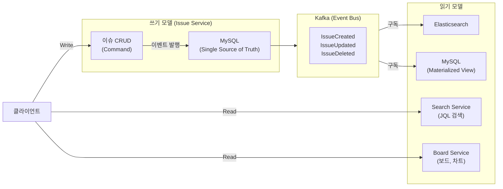
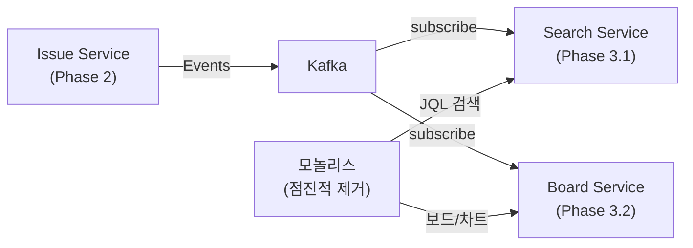

# Phase 3: 검색/보드 분리 (4주)

## 개요

Phase 3는 **읽기 최적화 서비스** 분리 단계입니다. Phase 2에서 완성된 Issue Service의 이벤트를 기반으로 Search Service와 Board & Report Service를 독립적으로 구축합니다.

### 목표

- **Search Service**: Elasticsearch 기반 이슈 검색 (JQL 지원)
- **Board & Report Service**: CQRS 패턴 기반 읽기 모델 (보드, 차트, 대시보드)
- 읽기 성능 향상 (응답시간 < 100ms)
- 검색/조회 기능의 완전한 독립화

---

## Phase 3 타임라인 (4주 = 20 업무일)

### 1~2주차: Search Service (Elasticsearch 도입)

| 날짜 | 작업 | 담당 | 결과물 |
|------|------|------|--------|
| 1주차 | Elasticsearch 클러스터 구성, JQL 파서 작성 | DevOps + Dev | ES 클러스터, JQL Parser |
| 1주차 | 검색 API 설계 및 구현 | Dev | Search Controller + Service |
| 2주차 | 이벤트 기반 인덱싱 (Kafka Consumer) | Dev | Kafka Consumer, Index Updater |
| 2주차 | 초기 데이터 마이그레이션 | Dev + DBA | Bulk indexing 스크립트 |

**완료 기준**:
- [ ] JQL 기반 검색 기능 정상 동작
- [ ] P95 응답시간 < 100ms (10만 건 이슈 기준)
- [ ] 실시간 인덱싱 지연 < 1초

### 3~4주차: Board & Report Service (CQRS 적용)

| 날짜 | 작업 | 담당 | 결과물 |
|------|------|------|--------|
| 3주차 | 읽기 모델 설계 (CQRS) | Dev | Read Model Schema, DB |
| 3주차 | 보드 및 리포트 API 구현 | Dev | Board Controller, Report Service |
| 4주차 | 이벤트 기반 데이터 동기화 | Dev | Event Consumer, Updater |
| 4주차 | Redis 캐시 전략 재설계 | Dev + DevOps | Cache Configuration |

**완료 기준**:
- [ ] 스프린트 보드 조회: P95 < 50ms
- [ ] 번다운 차트 조회: P95 < 50ms
- [ ] 캐시 적중률 > 80%

---

## 핵심 아키텍처 변화

### Before (모놀리스)
```
Issue Service
├── 이슈 CRUD (쓰기)
├── 댓글, 감사 로그
├── 검색 (모놀리스 DB 직접 쿼리)
├── 보드/차트 (메모리 계산)
└── 대시보드 (Redis 캐시)
```

### After (MSA)
```
Issue Service (쓰기 모델)
├── 이슈 CRUD
├── 댓글, 감사 로그
└── Events 발행
    ├─→ Kafka
        ├─→ Search Service (읽기: Elasticsearch)
        ├─→ Board Service (읽기: MySQL)
        └─→ Report Service (읽기: 집계)
```

---

## 기술 스택 비교

| 계층 | Phase 2 (Issue) | Phase 3 (Search) | Phase 3 (Board) |
|------|-----------------|------------------|-----------------|
| 프레임워크 | Spring Boot 4.0.3 | Spring Boot 4.0.3 | Spring Boot 4.0.3 |
| 데이터 저장소 | MySQL | Elasticsearch 8.x | MySQL |
| 캐시 | Redis (로컬) | Redis (분산) | Redis (분산) |
| 메시지 큐 | Kafka | Kafka | Kafka |
| 패턴 | Event Sourcing | CQRS (Read) | CQRS (Read) |
| 포트 | 8081 | 8085 | 8084 |

---

## CQRS (Command Query Responsibility Segregation)

CQRS는 **쓰기**와 **읽기** 모델을 분리하는 패턴입니다.

### 아키텍처



### 장점
- **성능**: 읽기와 쓰기 최적화 각각 가능
- **확장성**: 읽기 서버를 독립적으로 스케일
- **일관성**: 최종 일관성 (Eventual Consistency)

### 단점
- **복잡성**: 이벤트 처리 및 동기화 로직 필요
- **지연**: 이벤트 전파 지연 (보통 1~3초)

---

## 데이터 동기화 전략

### 시간표

```
Issue Service (쓰기)              Search Service (읽기)
    |                                |
    v                                v
[이슈 저장] T=0ms                   
[이벤트 발행] T=10ms ─→ Kafka ─→ 
                     ↓        ↓
                [소비] T=50ms
                [인덱싱] T=100ms
                
최대 지연: ~100ms (보통 50ms 이하)
```

### 재시도 전략

```
발행 실패 → Outbox 패턴 → Poller (5초마다)
         ↓
      재발행 (최대 3회)
         ↓
      DLQ (수동 개입 필요)
```

---

## 성능 목표 (NFR)

| 메트릭 | 목표 | 비고 |
|--------|------|------|
| **검색 응답시간** | P95 < 100ms | 100만 건 기준 |
| **검색 지연** | < 1초 | 이슈 변경 후 인덱싱 |
| **보드 조회 응답시간** | P95 < 50ms | 캐시 활용 |
| **차트 생성 응답시간** | P95 < 200ms | 집계 필요 시 |
| **캐시 적중률** | > 80% | 주요 조회 |
| **이벤트 처리 지연** | < 500ms | 99.9% 이상 |

---

## 배포 순서

### 1단계: Search Service (무중단)
1. Elasticsearch 클러스터 구축
2. Search Service 배포 (Issue Service와 병행)
3. 초기 데이터 마이그레이션 (배경)
4. 모놀리스 검색 호출 → Search Service로 리다이렉트

### 2단계: Board Service (무중단)
1. Board & Report Service 배포
2. 읽기 모델 데이터 초기화 (배경)
3. 모놀리스 보드 호출 → Board Service로 리다이렉트

### 3단계: 모놀리스 정리
- 모놀리스 검색/보드 코드 제거
- 모놀리스 Elasticsearch 인스턴스 폐기

---

## 의존성 관계도



---

## 주요 체크포인트

| 주차 | 체크포인트 | 조건 |
|------|-----------|------|
| 1주차 | ES 클러스터 준비 완료 | 클러스터 헬스 GREEN |
| 1주차 | JQL 파서 검증 | 100개 쿼리 파싱 성공 |
| 2주차 | 실시간 인덱싱 검증 | 지연 < 500ms |
| 2주차 | 초기 마이그레이션 완료 | 100% 데이터 이동 |
| 3주차 | 읽기 모델 동기화 | 데이터 일관성 확인 |
| 4주차 | 캐시 전략 최적화 | 적중률 > 80% |
| 배포 | 모놀리스 호환성 | 기존 API 호출 정상 |

---

## 참고 문서

- `01-search-service.md`: Search Service 상세
- `02-board-report-service.md`: Board & Report Service 상세
- Phase 2: Issue Service (기초)
