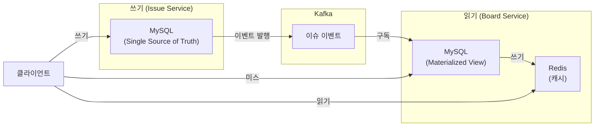

# Board & Report Service 분리 (CQRS)

## 서비스 개요

Board & Report Service는 **읽기 최적화 서비스**로 스프린트 보드, 차트, 대시보드 기능을 제공합니다. CQRS 패턴을 적용하여 읽기 모델(Materialized View)을 별도로 유지합니다.

| 속성 | 값 |
|------|-----|
| **포트** | 8084 |
| **데이터베이스** | MySQL (읽기 모델용) |
| **캐시** | Redis (성능 최적화) |
| **메시지 큐** | Kafka (이벤트 구독) |
| **응답시간 목표** | P95 < 50ms |

---

## 서비스 책임

| 기능 | 설명 | 패턴 |
|------|------|------|
| **스프린트 보드** | 칸반 보드 (상태별 이슈) | CQRS Read |
| **번다운 차트** | 스프린트 진행도 | 집계 (Aggregation) |
| **속도 차트** | 스프린트별 속도 추이 | 집계 + 시계열 |
| **CFD 차트** | Cumulative Flow Diagram | 집계 + 시계열 |
| **대시보드** | 프로젝트 개요 (가젯) | CQRS Read |
| **리포트** | 다양한 분석 보고서 | 배치 처리 |

---

## CQRS 패턴

### 아키텍처



### Materialized View

MySQL 읽기 모델은 미리 계산된 집계 데이터를 저장합니다.

```sql
-- 스프린트 보드 뷰 (읽기 전용)
CREATE TABLE sprint_board_view (
    id BIGINT PRIMARY KEY,
    sprintId BIGINT NOT NULL,
    issueKey VARCHAR(50) NOT NULL,
    status VARCHAR(50) NOT NULL,
    priority VARCHAR(50),
    estimatedTime INT,
    timeSpent INT,
    assigneeId BIGINT,
    ORDER_IN_STATUS INT,
    updatedAt TIMESTAMP
);

-- 번다운 차트 데이터
CREATE TABLE sprint_burndown_view (
    id BIGINT PRIMARY KEY,
    sprintId BIGINT NOT NULL,
    sprintDay INT,
    remainingWork DECIMAL(10, 2),
    completedWork DECIMAL(10, 2),
    idealBurndown DECIMAL(10, 2),
    createdAt TIMESTAMP
);

-- 속도 데이터
CREATE TABLE sprint_velocity_view (
    id BIGINT PRIMARY KEY,
    projectId BIGINT NOT NULL,
    sprintId BIGINT NOT NULL,
    sprintName VARCHAR(100),
    estimatedWork DECIMAL(10, 2),
    completedWork DECIMAL(10, 2),
    velocity DECIMAL(10, 2),
    completedAt TIMESTAMP
);
```

---

## 읽기 모델 데이터 동기화

### 1. 이벤트 핸들러

```java
@Service
public class SprintBoardEventHandler {
    
    @Autowired
    private SprintBoardViewRepository boardViewRepository;
    
    @Autowired
    private SprintBurndownViewRepository burndownRepository;
    
    /**
     * 이슈 생성 이벤트 처리
     */
    @KafkaListener(topics = "issue-created", groupId = "board-service")
    @Async
    @Transactional
    public void handleIssueCreated(IssueCreatedEvent event) {
        try {
            Issue issue = event.getIssue();
            
            // 스프린트 보드에 추가
            if (issue.getSprintId() != null) {
                SprintBoardView view = SprintBoardView.builder()
                    .sprintId(issue.getSprintId())
                    .issueKey(issue.getKey())
                    .status(issue.getStatus())
                    .priority(issue.getPriority())
                    .estimatedTime(issue.getEstimatedTime())
                    .assigneeId(issue.getAssigneeId())
                    .updatedAt(LocalDateTime.now())
                    .build();
                
                boardViewRepository.save(view);
                
                // 번다운 차트 업데이트
                updateBurndownChart(issue.getSprintId());
            }
            
        } catch (Exception e) {
            logger.error("Failed to handle issue created event", e);
        }
    }
    
    /**
     * 이슈 상태 변경 이벤트 처리
     */
    @KafkaListener(topics = "issue-status-changed", groupId = "board-service")
    @Async
    @Transactional
    public void handleIssueStatusChanged(IssueStatusChangedEvent event) {
        try {
            Issue issue = event.getIssue();
            
            if (issue.getSprintId() != null) {
                // 보드 뷰 업데이트
                SprintBoardView view = boardViewRepository
                    .findBySprintIdAndIssueKey(issue.getSprintId(), issue.getKey());
                
                if (view != null) {
                    view.setStatus(issue.getStatus());
                    boardViewRepository.save(view);
                    
                    // 번다운 차트 업데이트
                    updateBurndownChart(issue.getSprintId());
                }
            }
            
        } catch (Exception e) {
            logger.error("Failed to handle issue status changed event", e);
        }
    }
    
    /**
     * 이슈 삭제 이벤트 처리
     */
    @KafkaListener(topics = "issue-deleted", groupId = "board-service")
    @Async
    @Transactional
    public void handleIssueDeleted(IssueDeletedEvent event) {
        try {
            String issueKey = event.getIssue().getKey();
            
            // 보드에서 제거
            List<SprintBoardView> views = boardViewRepository
                .findByIssueKey(issueKey);
            
            for (SprintBoardView view : views) {
                boardViewRepository.deleteById(view.getId());
                updateBurndownChart(view.getSprintId());
            }
            
        } catch (Exception e) {
            logger.error("Failed to handle issue deleted event", e);
        }
    }
    
    /**
     * 번다운 차트 재계산
     */
    @Transactional
    private void updateBurndownChart(Long sprintId) {
        // 스프린트 정보 조회
        Sprint sprint = sprintRepository.findById(sprintId)
            .orElseThrow(() -> new SprintNotFoundException(sprintId));
        
        // 현재 미완료 작업 계산
        long remainingWork = boardViewRepository
            .findBySprintIdAndStatusNotIn(sprintId, List.of("CLOSED", "RESOLVED"))
            .stream()
            .mapToLong(view -> view.getEstimatedTime() != null ? view.getEstimatedTime() : 0)
            .sum();
        
        // 완료 작업 계산
        long completedWork = boardViewRepository
            .findBySprintIdAndStatusIn(sprintId, List.of("CLOSED", "RESOLVED"))
            .stream()
            .mapToLong(view -> view.getEstimatedTime() != null ? view.getEstimatedTime() : 0)
            .sum();
        
        // 스프린트 경과일
        int sprintDay = calculateSprintDay(sprint);
        
        // 이상적인 번다운
        double totalWork = remainingWork + completedWork;
        double idealBurndown = totalWork * (1.0 - (double) sprintDay / sprint.getDurationDays());
        
        // 번다운 데이터 저장
        SprintBurndownView burndownView = SprintBurndownView.builder()
            .sprintId(sprintId)
            .sprintDay(sprintDay)
            .remainingWork(BigDecimal.valueOf(remainingWork))
            .completedWork(BigDecimal.valueOf(completedWork))
            .idealBurndown(BigDecimal.valueOf(Math.max(0, idealBurndown)))
            .createdAt(LocalDateTime.now())
            .build();
        
        burndownRepository.save(burndownView);
    }
    
    private int calculateSprintDay(Sprint sprint) {
        LocalDateTime now = LocalDateTime.now();
        if (now.isBefore(sprint.getStartDate())) {
            return 0;
        }
        return (int) ChronoUnit.DAYS.between(sprint.getStartDate(), now) + 1;
    }
}
```

---

## 보드 조회 API

### BoardService

```java
@Service
@Transactional(readOnly = true)
public class BoardService {
    
    @Autowired
    private SprintBoardViewRepository boardViewRepository;
    
    @Autowired
    private CacheManager cacheManager;
    
    /**
     * 스프린트 보드 조회
     */
    @Cacheable(value = "sprint-board", key = "#sprintId")
    public SprintBoardResponse getSprintBoard(Long sprintId) {
        // 보드 데이터 조회 (상태별 이슈)
        Map<String, List<IssueCardResponse>> issuesByStatus = boardViewRepository
            .findBySprintId(sprintId)
            .stream()
            .collect(Collectors.groupingBy(
                SprintBoardView::getStatus,
                Collectors.mapping(
                    this::toIssueCard,
                    Collectors.toList()
                )
            ));
        
        return SprintBoardResponse.builder()
            .sprintId(sprintId)
            .issuesByStatus(issuesByStatus)
            .totalIssues(boardViewRepository.countBySprintId(sprintId))
            .completedIssues(boardViewRepository
                .countBySprintIdAndStatusIn(sprintId, List.of("CLOSED", "RESOLVED")))
            .build();
    }
    
    /**
     * 스프린트 보드 (필터링)
     */
    @Cacheable(value = "sprint-board-filtered", key = "#sprintId + '-' + #filter")
    public SprintBoardResponse getSprintBoardFiltered(
        Long sprintId,
        String assigneeId) {
        
        Map<String, List<IssueCardResponse>> issuesByStatus = boardViewRepository
            .findBySprintIdAndAssigneeId(sprintId, Long.parseLong(assigneeId))
            .stream()
            .collect(Collectors.groupingBy(
                SprintBoardView::getStatus,
                Collectors.mapping(this::toIssueCard, Collectors.toList())
            ));
        
        return SprintBoardResponse.builder()
            .sprintId(sprintId)
            .issuesByStatus(issuesByStatus)
            .filteredBy(assigneeId)
            .build();
    }
    
    private IssueCardResponse toIssueCard(SprintBoardView view) {
        return IssueCardResponse.builder()
            .key(view.getIssueKey())
            .status(view.getStatus())
            .priority(view.getPriority())
            .estimatedTime(view.getEstimatedTime())
            .timeSpent(view.getTimeSpent())
            .assigneeId(view.getAssigneeId())
            .build();
    }
}
```

---

## 차트 & 리포트

### ReportService

```java
@Service
public class ReportService {
    
    @Autowired
    private SprintVelocityViewRepository velocityRepository;
    
    @Autowired
    private SprintBurndownViewRepository burndownRepository;
    
    /**
     * 속도 차트 (시계열)
     */
    @Cacheable(value = "velocity-report", key = "#projectId")
    public VelocityChartResponse getVelocityChart(Long projectId) {
        List<SprintVelocityView> velocities = velocityRepository
            .findByProjectIdOrderByCompletedAtDesc(projectId)
            .stream()
            .limit(10)
            .collect(Collectors.toList());
        
        List<VelocityData> data = velocities.stream()
            .sorted(Comparator.comparing(SprintVelocityView::getCompletedAt))
            .map(v -> VelocityData.builder()
                .sprintName(v.getSprintName())
                .planned(v.getEstimatedWork().doubleValue())
                .actual(v.getCompletedWork().doubleValue())
                .velocity(v.getVelocity().doubleValue())
                .build())
            .collect(Collectors.toList());
        
        return VelocityChartResponse.builder()
            .projectId(projectId)
            .data(data)
            .averageVelocity(calculateAverageVelocity(velocities))
            .build();
    }
    
    /**
     * 번다운 차트
     */
    @Cacheable(value = "burndown-chart", key = "#sprintId")
    public BurndownChartResponse getBurndownChart(Long sprintId) {
        List<SprintBurndownView> burndowns = burndownRepository
            .findBySprintIdOrderByCreatedAt(sprintId);
        
        List<BurndownData> data = burndowns.stream()
            .map(b -> BurndownData.builder()
                .day(b.getSprintDay())
                .remaining(b.getRemainingWork().doubleValue())
                .completed(b.getCompletedWork().doubleValue())
                .ideal(b.getIdealBurndown().doubleValue())
                .build())
            .collect(Collectors.toList());
        
        return BurndownChartResponse.builder()
            .sprintId(sprintId)
            .data(data)
            .isOnTrack(isOnTrack(burndowns))
            .build();
    }
    
    /**
     * CFD (Cumulative Flow Diagram)
     */
    @Cacheable(value = "cfd-chart", key = "#projectId + '-' + #days")
    public CfdChartResponse getCfdChart(Long projectId, Integer days) {
        LocalDateTime startDate = LocalDateTime.now().minusDays(days);
        
        List<CfdData> data = buildCfdData(projectId, startDate);
        
        return CfdChartResponse.builder()
            .projectId(projectId)
            .days(days)
            .data(data)
            .build();
    }
    
    private boolean isOnTrack(List<SprintBurndownView> burndowns) {
        if (burndowns.size() < 2) return true;
        
        SprintBurndownView latest = burndowns.get(burndowns.size() - 1);
        
        // 실제 번다운이 이상적 번다운보다 낮으면 좋은 상태
        return latest.getRemainingWork()
            .compareTo(latest.getIdealBurndown()) <= 0;
    }
    
    private List<CfdData> buildCfdData(Long projectId, LocalDateTime startDate) {
        // 시간대별 상태 분포 계산
        // Open, In Progress, Closed 등의 누적 수
        // ...
        return new ArrayList<>();
    }
    
    private BigDecimal calculateAverageVelocity(List<SprintVelocityView> velocities) {
        return velocities.stream()
            .map(SprintVelocityView::getVelocity)
            .reduce(BigDecimal.ZERO, BigDecimal::add)
            .divide(BigDecimal.valueOf(Math.max(1, velocities.size())));
    }
}
```

---

## 대시보드 & 가젯

### DashboardService

```java
@Service
public class DashboardService {
    
    @Autowired
    private DashboardRepository dashboardRepository;
    
    @Autowired
    private DashboardGadgetRepository gadgetRepository;
    
    @Autowired
    private BoardService boardService;
    
    @Autowired
    private ReportService reportService;
    
    /**
     * 프로젝트 대시보드 조회
     */
    @Cacheable(value = "dashboard", key = "#projectId")
    public DashboardResponse getDashboard(Long projectId) {
        Dashboard dashboard = dashboardRepository.findByProjectId(projectId)
            .orElseThrow(() -> new DashboardNotFoundException(projectId));
        
        List<GadgetResponse> gadgets = gadgetRepository
            .findByDashboardIdOrderByPosition(dashboard.getId())
            .stream()
            .map(this::renderGadget)
            .collect(Collectors.toList());
        
        return DashboardResponse.builder()
            .projectId(projectId)
            .gadgets(gadgets)
            .build();
    }
    
    /**
     * 가젯 렌더링
     */
    private GadgetResponse renderGadget(DashboardGadget gadget) {
        switch (gadget.getType()) {
            case "SPRINT_BOARD":
                return GadgetResponse.builder()
                    .id(gadget.getId())
                    .type(gadget.getType())
                    .title("스프린트 보드")
                    .data(boardService.getSprintBoard(gadget.getSprintId()))
                    .build();
                
            case "VELOCITY_CHART":
                return GadgetResponse.builder()
                    .id(gadget.getId())
                    .type(gadget.getType())
                    .title("속도 차트")
                    .data(reportService.getVelocityChart(gadget.getProjectId()))
                    .build();
                
            case "BURNDOWN_CHART":
                return GadgetResponse.builder()
                    .id(gadget.getId())
                    .type(gadget.getType())
                    .title("번다운 차트")
                    .data(reportService.getBurndownChart(gadget.getSprintId()))
                    .build();
                
            default:
                return null;
        }
    }
}
```

---

## Redis 캐시 전략

### 캐시 설정

```yaml
spring:
  cache:
    type: redis
    redis:
      time-to-live: 300000  # 5분
      cache-null-values: true
    
  data:
    redis:
      host: ${REDIS_HOST:localhost}
      port: ${REDIS_PORT:6379}
      timeout: 2000ms
      jedis:
        pool:
          max-active: 100
          max-idle: 50
          min-idle: 10
```

### 캐시 무효화 전략

```java
@Service
public class CacheInvalidationService {
    
    @Autowired
    private CacheManager cacheManager;
    
    /**
     * 이슈 변경 시 관련 캐시 무효화
     */
    @EventListener
    public void onIssueUpdated(IssueUpdatedEvent event) {
        Issue issue = event.getIssue();
        
        // 스프린트 보드 캐시 무효화
        if (issue.getSprintId() != null) {
            invalidateCache("sprint-board", String.valueOf(issue.getSprintId()));
            invalidateCache("sprint-board-filtered", "*");
        }
        
        // 번다운 차트 캐시 무효화
        invalidateCache("burndown-chart", String.valueOf(issue.getSprintId()));
    }
    
    @EventListener
    public void onSprintCompleted(SprintCompletedEvent event) {
        // 속도 및 속도 차트 캐시 무효화
        invalidateCache("velocity-report", String.valueOf(event.getProjectId()));
        invalidateCache("cfd-chart", "*");
    }
    
    private void invalidateCache(String cacheName, String key) {
        Cache cache = cacheManager.getCache(cacheName);
        if (cache != null) {
            if ("*".equals(key)) {
                cache.clear();
            } else {
                cache.evict(key);
            }
            logger.info("Invalidated cache: {} - {}", cacheName, key);
        }
    }
}
```

---

## 배치 처리 (야간 집계)

### 배치 작업

```java
@Configuration
@EnableBatchProcessing
public class ReportBatchConfiguration {
    
    @Bean
    public Job dailyReportJob(JobRepository jobRepository, 
                             PlatformTransactionManager transactionManager) {
        return new JobBuilder("dailyReportJob", jobRepository)
            .start(velocityCalculationStep(jobRepository, transactionManager))
            .next(cfdCalculationStep(jobRepository, transactionManager))
            .build();
    }
    
    @Bean
    public Step velocityCalculationStep(JobRepository jobRepository,
                                       PlatformTransactionManager transactionManager) {
        return new StepBuilder("velocityCalculationStep", jobRepository)
            .<Sprint, SprintVelocityView>chunk(100, transactionManager)
            .reader(sprintReader())
            .processor(velocityProcessor())
            .writer(velocityWriter())
            .build();
    }
    
    @Bean
    public ItemReader<Sprint> sprintReader() {
        return new JpaPagingItemReader<Sprint>() {{
            setEntityManagerFactory(entityManagerFactory);
            setQueryString("SELECT s FROM Sprint s WHERE s.status = 'COMPLETED'");
            setPageSize(100);
        }};
    }
    
    @Bean
    public ItemProcessor<Sprint, SprintVelocityView> velocityProcessor() {
        return sprint -> {
            // 스프린트 완료 이후 속도 계산
            // ...
            return null;
        };
    }
}
```

---

## 작업 체크리스트

### CQRS 읽기 모델
- [ ] Materialized View 테이블 설계
- [ ] 읽기 전용 Repository 작성
- [ ] 이벤트 핸들러 구현 (데이터 동기화)

### 보드 조회
- [ ] SprintBoardView 엔티티 생성
- [ ] BoardService 구현
- [ ] BoardController 작성
- [ ] 보드 필터링 기능

### 차트 & 리포트
- [ ] BurndownView, VelocityView 엔티티
- [ ] ReportService 구현
- [ ] 차트 API 작성
- [ ] CFD 차트 로직

### 대시보드
- [ ] Dashboard, DashboardGadget 엔티티
- [ ] DashboardService 구현
- [ ] 가젯 렌더링 로직
- [ ] 대시보드 커스터마이징

### 캐싱 & 성능
- [ ] Redis 캐시 설정
- [ ] 캐시 무효화 전략
- [ ] 배치 작업 (야간 집계)
- [ ] 성능 테스트 (P95 < 50ms)

---

## 성능 목표 (NFR)

| 메트릭 | 목표 |
|--------|------|
| 보드 조회 응답시간 | P95 < 50ms |
| 차트 생성 응답시간 | P95 < 200ms |
| 캐시 적중률 | > 80% |
| 데이터 동기화 지연 | < 1초 |

---

## 분리 난이도: ★★☆☆☆ (2/5 - 낮음)

**이유**:
- CQRS 패턴은 읽기 전용 (쓰기 X)
- 이벤트 기반 동기화 (복잡도 중간)
- 집계 계산 (상대적으로 단순)

**완화 전략**:
- Materialized View 미리 설계
- 단계별 이벤트 핸들러 구현
- 철저한 데이터 검증

---

## 참고 문서

- `00-phase-3-overview.md`: Phase 3 전체 개요
- `01-search-service.md`: Search Service
- Phase 2: Issue Service (이벤트 소스)
