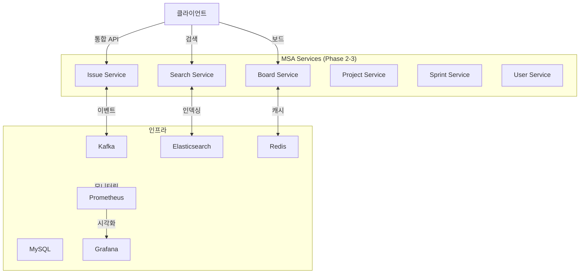

# Phase 4: 안정화 & 최적화 (3주)

## 개요

Phase 4는 **전체 MSA 시스템의 안정성과 성능을 검증**하는 최종 단계입니다. Phase 2-3에서 분리된 모든 서비스의 통합 검증, 모놀리스 완전 제거, 그리고 프로덕션 운영 준비를 완료합니다.

### 목표

- **시스템 통합 검증**: 부하 테스트, 장애 주입 테스트
- **성능 최적화**: 병목 지점 제거, 응답시간 개선
- **운영 준비**: 모니터링, 로깅, 알림 체계 구축
- **모놀리스 제거**: 완전한 MSA 전환

---

## Phase 4 타임라인 (3주 = 15 업무일)

### 1주차: 부하 테스트 & 성능 튜닝

| 날짜 | 작업 | 담당 | 결과물 |
|------|------|------|--------|
| 1일-2일 | 부하 테스트 계획, 시나리오 작성 | QA + Dev | Test Scenario Document |
| 3일-4일 | k6 또는 Gatling 스크립트 작성 | QA | Load Testing Scripts |
| 5일 | 기초 부하 테스트 실행 | QA | 초기 성능 데이터 |

**완료 기준**:
- [ ] NFR 달성 (응답시간, 에러율)
- [ ] 병목 지점 식별 및 해결
- [ ] 부하 테스트 보고서 작성

### 2주차: 장애 주입 테스트 & 모니터링

| 날짜 | 작업 | 담당 | 결과물 |
|------|------|------|--------|
| 1일-2일 | Chaos Engineering 계획 | DevOps + QA | Chaos Test Plan |
| 3일-4일 | 네트워크, 서비스 장애 주입 | QA | 장애 복구 검증 |
| 5일 | 모니터링 & 알림 체계 구축 | DevOps | Prometheus, Grafana |

**완료 기준**:
- [ ] 주요 서비스 장애 복구 시간 < 5분
- [ ] Circuit Breaker 정상 동작
- [ ] 모니터링 대시보드 활성화

### 3주차: 운영 문서 & 모놀리스 제거

| 날짜 | 작업 | 담당 | 결과물 |
|------|------|------|--------|
| 1일-2일 | 운영 플레이북, 장애 대응 가이드 | Tech Lead | Operations Guide |
| 3일 | 분산 추적 (OpenTelemetry) 구축 | DevOps | Jaeger Configuration |
| 4일-5일 | 모놀리스 완전 제거 및 정리 | DevOps + Dev | 완전한 MSA 전환 |

**완료 기준**:
- [ ] 운영 문서 완성
- [ ] 모놀리스 완전 폐기
- [ ] 프로덕션 배포 승인

---

## 작업 항목

### 1. 성능 검증

#### 1.1 부하 테스트
- [ ] 이슈 CRUD 동시 100명 (P95 < 200ms)
- [ ] 스프린트 보드 조회 동시 100명 (P95 < 50ms)
- [ ] JQL 검색 (복합 쿼리, P95 < 100ms)
- [ ] 파일 업로드/다운로드 동시 50명
- [ ] **목표**: 시스템 전체 에러율 < 0.1%

#### 1.2 장애 주입 테스트
- [ ] Issue Service 다운 → 보드 서비스 Fallback
- [ ] Database 연결 풀 고갈 → Circuit Breaker 작동
- [ ] Kafka 브로커 다운 → 이벤트 Retry
- [ ] Redis 장애 → 직접 DB 조회
- [ ] **목표**: 부분 장애 상황에서도 서비스 가능

#### 1.3 성능 튜닝
- [ ] 느린 쿼리 최적화 (< 100ms)
- [ ] N+1 쿼리 제거
- [ ] 인덱스 추가/재정렬
- [ ] 캐시 히트율 > 80%
- [ ] **목표**: P99 응답시간 < 500ms

### 2. 장애 대응

#### 2.1 운영 플레이북
- [ ] 주요 서비스별 헬스 체크 엔드포인트
- [ ] 서비스 무응답 시 대응 절차
- [ ] Kafka Consumer Lag 증가 시 대응
- [ ] DB 연결 풀 고갈 시 대응
- [ ] Redis 장애 시 대응
- [ ] 데이터 불일치 감지 및 복구

#### 2.2 모니터링 & 알림
- [ ] Prometheus: 메트릭 수집 (CPU, 메모리, 응답시간)
- [ ] Grafana: 대시보드 구성
- [ ] OpenTelemetry + Jaeger: 분산 추적
- [ ] ELK Stack: 로그 중앙화
- [ ] AlertManager: 알림 규칙

#### 2.3 롤백 계획
- [ ] 서비스별 빠른 롤백 절차 (< 5분)
- [ ] DB 마이그레이션 롤백 계획
- [ ] 데이터 불일치 복구 방법

### 3. 보안

#### 3.1 보안 감사
- [ ] API 인증/인가 검증
- [ ] 민감 정보 암호화 (PII, 토큰)
- [ ] CORS, CSRF 방어
- [ ] SQL Injection, XSS 취약점 검사
- [ ] API Rate Limiting

#### 3.2 권한 관리
- [ ] RBAC 최종 검증 (모든 엔드포인트)
- [ ] 감사 로그 정상 기록 확인
- [ ] 개인정보 접근 제어 검증

### 4. 모놀리스 제거

#### 4.1 코드 정리
- [ ] 모놀리스 내 불필요한 코드 제거
- [ ] FeignClient 호출 테스트
- [ ] 모놀리스 API 폐지 (또는 Facade 패턴)

#### 4.2 데이터베이스 정리
- [ ] 모놀리스 테이블에서 MSA 테이블로 모두 이동 확인
- [ ] 모놀리스 불필요한 컬럼 제거 (또는 마스킹)
- [ ] 데이터 검증 (행 수 비교)

#### 4.3 배포
- [ ] 모놀리스 서비스 중단
- [ ] 모놀리스 인스턴스 폐기
- [ ] 모놀리스 DB 백업 (장기 보관)

---

## 완료 기준 (Definition of Done)

### 기능 요구사항
- [ ] 모든 Phase 2-3 기능 정상 동작
- [ ] 부하 테스트 NFR 달성
- [ ] 장애 복구 자동화 확인

### 비기능 요구사항

| 메트릭 | 목표 | 현황 |
|--------|------|------|
| **이슈 CRUD 응답시간** | P95 < 200ms | - |
| **보드 조회 응답시간** | P95 < 50ms | - |
| **검색 응답시간** | P95 < 100ms | - |
| **에러율** | < 0.1% | - |
| **가용성** | 99.5% | - |
| **데이터 동기화 지연** | < 500ms | - |
| **캐시 적중률** | > 80% | - |

### 문서 & 운영
- [ ] 운영 플레이북 완성
- [ ] 모니터링 대시보드 활성화
- [ ] 장애 대응 가이드 작성
- [ ] 배포 절차 문서화
- [ ] 롤백 계획 수립

### 보안
- [ ] 보안 감사 완료
- [ ] 취약점 제로
- [ ] RBAC 최종 검증

---

## 의존성 관계도



---

## 주요 체크포인트

| 체크포인트 | 조건 | 담당 |
|-----------|------|------|
| 부하 테스트 통과 | NFR 달성 | QA |
| Circuit Breaker 검증 | 자동 복구 확인 | QA |
| 모니터링 활성화 | 대시보드 실시간 데이터 | DevOps |
| 보안 감사 완료 | 취약점 제로 | Security |
| 모놀리스 제거 | 완전한 MSA 전환 | DevOps |

---

## 배포 절차

### 무중단 배포 (Blue-Green)

```
Stage 1: Green 환경 준비
├── Green 클러스터 생성
├── Green에 MSA 배포
└── 데이터 동기화 확인

Stage 2: 트래픽 전환
├── Load Balancer 설정 변경
├── Green 환경으로 10% 트래픽
├── 모니터링 (5분)
├── Green 환경으로 50% 트래픽
├── 모니터링 (10분)
└── Green 환경으로 100% 트래픽

Stage 3: 모놀리스 제거
├── Blue 인스턴스 종료
├── 모놀리스 데이터 백업
└── 정리
```

### 롤백 절차 (RTO < 5분)

```
문제 감지 → 알림 → Load Balancer Blue로 전환 → 서비스 정상화
```

---

## 예상 일정

| 항목 | 기간 | 시작 | 종료 |
|------|------|------|------|
| Phase 2 (Issue Service) | 4주 | 주 1 | 주 4 |
| Phase 3 (Search/Board) | 4주 | 주 5 | 주 8 |
| Phase 4 (안정화) | 3주 | 주 9 | 주 11 |
| **전체** | **11주** | | |

---

## 참고 문서

- `01-load-testing.md`: 부하 테스트 & 장애 주입
- `02-operations-guide.md`: 운영 가이드 & 플레이북
