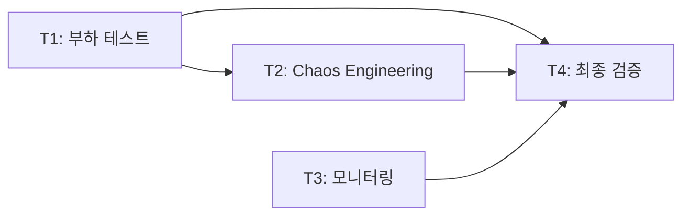

# Phase 4 — 안정화 & 최적화 태스크 워크플로우

> **목표**: Phase 1~3에서 구축한 MSA 시스템의 안정성, 성능, 보안을 검증하고 프로덕션 운영 준비를 완료한다.
>
> **기간**: 3주 (15 업무일)
> **베이스 브랜치**: `develop`
> **선행 조건**: Phase 3 완료 (PR #12~#14 머지)

---

## 📋 태스크 카탈로그

| Task | 이름 | 브랜치 | 예상 기간 | 의존 |
|------|------|--------|----------|------|
| **T1** | k6 부하 테스트 스크립트 + NFR 검증 | `feature/phase-4-load-test` | 4~5일 | — |
| **T2** | Chaos Engineering + Resilience 패턴 | `feature/phase-4-chaos` | 3~4일 | T1 |
| **T3** | 모니터링/알림/대시보드 구축 | `feature/phase-4-monitoring` | 3~4일 | — |
| **T4** | 보안 감사 + 최종 통합 검증 + GA 준비 | `feature/phase-4-ga-readiness` | 3일 | T1, T2, T3 |

### 의존 관계

> **T1과 T3는 병렬 진행 가능**. T2는 T1의 성능 기준선 확보 후 시작. T4는 모든 태스크 완료 후 최종 검증.

---

## 🔧 커밋 전략

Phase 4는 **인프라/설정/스크립트** 중심이므로 도메인 5-step 패턴 대신 **기능 단위 커밋**을 사용한다.

| 커밋 타입 | 용도 | 예시 |
|----------|------|------|
| `test(perf)` | 부하 테스트 스크립트 | `test(perf): k6 이슈 CRUD 부하 테스트 스크립트` |
| `feat(chaos)` | 장애 주입 시나리오 | `feat(chaos): 서비스 다운 + Circuit Breaker 검증` |
| `feat(monitor)` | 모니터링 설정 | `feat(monitor): Grafana 대시보드 JSON 프로비저닝` |
| `chore(security)` | 보안 감사 | `chore(security): OWASP 보안 점검 체크리스트` |
| `docs` | 보고서/플레이북 | `docs: Phase 4 부하 테스트 결과 보고서` |

---

## ✅ Phase 4 Definition of Done (전체)

### 성능 (NFR)
- [ ] 이슈 CRUD P95 < 200ms (동시 100명)
- [ ] 스프린트 보드 P95 < 50ms (동시 200명, Redis 캐시)
- [ ] JQL 검색 P95 < 100ms (복합 쿼리)
- [ ] 시스템 전체 에러율 < 0.1%
- [ ] 캐시 히트율 > 80%

### 복원력
- [ ] 서비스 다운 시 Circuit Breaker → Fallback (5초 이내 전환)
- [ ] Kafka 장애 시 이벤트 자동 Retry + Consumer Lag 복구
- [ ] Redis 장애 시 DB 직접 조회 폴백
- [ ] DB 연결 풀 고갈 시 자동 복구
- [ ] MTTR (평균 복구 시간) < 5분

### 모니터링
- [ ] Prometheus 메트릭 수집 (8 서비스 + MySQL + Redis + Kafka + ES)
- [ ] Grafana 대시보드 3종 (서비스 상태, 성능, 인프라)
- [ ] AlertManager 알림 규칙 10개+ (critical/warning)
- [ ] Loki 로그 대시보드 + LogQL 알림 3개+

### 보안
- [ ] OWASP Top 10 점검 완료
- [ ] API 인증/인가 전체 검증
- [ ] 민감 정보 암호화 확인
- [ ] Rate Limiting 동작 검증

### 문서
- [ ] 부하 테스트 결과 보고서
- [ ] 장애 대응 플레이북 5종 (검증 완료)
- [ ] 운영 가이드 최종본
- [ ] PROGRESS.md Phase 4 🟢 완료
